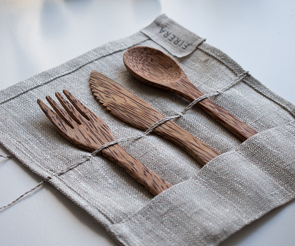

<!DOCTYPE html>
<html lang="en">
<head>
    <meta charset="UTF-8">
    <meta name="viewport" content="width=device-width, initial-scale=1.0">
    <meta http-equiv="X-UA-Compatible" content="ie=edge">
    <title>The Organic Store</title>
    <link rel='stylesheet' href='styles.css' />
    
</head>
<body>
   
    <nav>
        

                <a href="#">The Organic Store</a>
        

        

                <a href="#">OS</a>
        

        <ul class="navList">
            <li>
                <a href="about.html">About</a>
            </li>
            <li>
                <a href="store.html">Store</a>
            </li>
            <li>
                <a href="blog.html">Blog</a>
            </li>
        </ul>
    </nav>
    

    

         
            

              
            

          
            

              
            

          
            

              
            

          
            
            <a class="prev" onclick="plusSlides(-1)">&#10094;</a>
            <a class="next" onclick="plusSlides(1)">&#10095;</a>
          

          
          
          
          
          

    

        

                
                <h1>Our Store</h1>
                
Lorem ipsum dolor sit amet, consectetur adipiscing elit,
                        sed do eiusmod tempor incididunt ut labore et dolore magna
                        aliqua. Ut enim ad minim veniam, quis nostrud 
                        Lorem ipsum dolor sit amet, consectetur adipiscing elit,
                        sed do eiusmod tempor incididunt ut labore et dolore magna
                        aliqua. Ut enim ad minim veniam, quis nostrud.  

                        

                                <a class="button" href="store.html">Enter</a>
                            

        

        

                
                <h1>Our Blog</h1>
                
Lorem ipsum dolor sit amet, consectetur adipiscing elit,
                        sed do eiusmod tempor incididunt ut labore et dolore magna
                        aliqua. Ut enim ad minim veniam, quis nostrud 
                        Lorem ipsum dolor sit amet, consectetur adipiscing elit,
                        sed do eiusmod tempor incididunt ut labore et dolore magna
                        aliqua. Ut enim ad minim veniam, quis nostrud.
                    

                    

                    <a class="button" href="blog.html">Read More</a>
                

                
        

        
    

    
    
    
   

 
   

        
        
      

</body>

</html>
